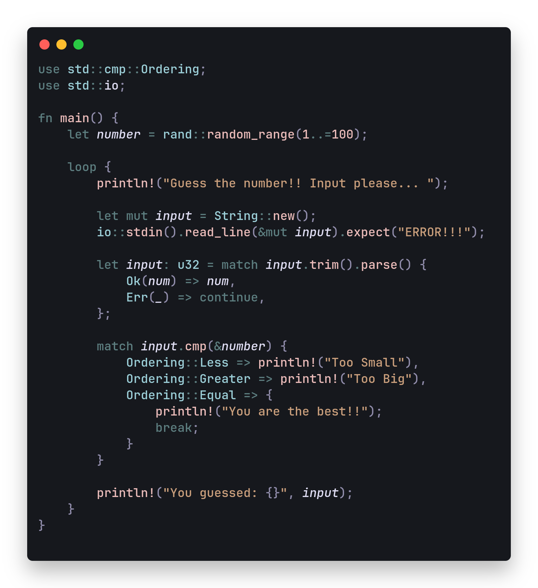
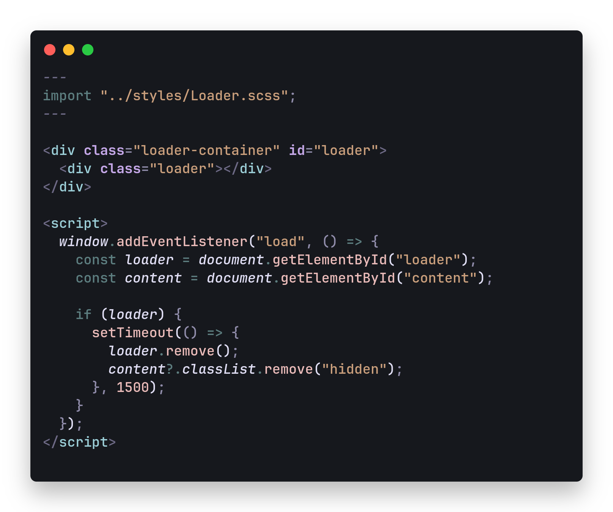
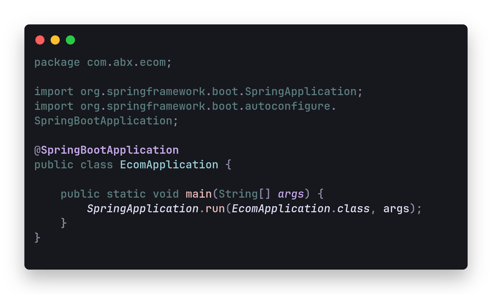

# 🌑 Hell Pine — A Darker Twist on Rosé Pine

> _“Born in the fire of tmux, refined for the calm of code.”_

**Hell Pine** is a bold, terminal-inspired dark theme for Visual Studio Code — a meticulously crafted evolution of [Rosé Pine](https://rosepinetheme.com/), born from the nuanced visual shifts experienced within **tmux** sessions. What began as a subtle observation became a deliberate design — optimized for developers who live in the terminal and demand both beauty and clarity in their workflow.

> This is Rosé Pine after going through hell... and coming back beautiful.

---

## ✨ Why Hell Pine?

While working with Rosé Pine inside `tmux`, I discovered unexpected but aesthetically pleasing color distortions — deeper shadows, punchier highlights, and an overall sharper contrast. It felt raw yet refined — and I knew it deserved to be more than a glitch.

**Hell Pine** is my response — a theme that retains the elegance of Rosé Pine while infusing it with terminal grit and expressive contrast. The result is a developer-centric palette perfect for long coding sessions, especially in split-pane, multi-window environments.

---


## Preview





---

## 🎨 Features

- 🖤 **Dark elegance** with enhanced contrast and visual edge  
- 🧠 **Focus-driven** colors for reduced eye fatigue  
- ⚡️ **Optimized** for terminal emulators and Tmux workflows  
- 🧩 Full language support, including:
  - HTML, CSS, JavaScript, TypeScript  
  - Java, Python, Go, C++  
  - Markdown, YAML, JSON, and more  

---

## 🚀 Installation

### 🔌 From the VS Code Marketplace

Simply search for `Hell Pine` in the Extensions tab or install directly via command:

```bash
ext install ABX.hell-pine
```
Or visit the Marketplace page here:
📎 https://marketplace.visualstudio.com/items?itemName=ABX.hell-pine
### 🛠️ Manual Installation (Development)

Until automatic updates roll out, you can also clone the repository manually:
``` bash
git clone https://github.com/AbiXnash/hell-pine.git
cd hell-pine
code .
```
Open the folder in VS Code and select the Hell Pine theme from the Command Palette or settings.

### 🙏 Acknowledgements

Huge appreciation to the creators of [Rosé Pine](https://rosepinetheme.com/) for the inspiration and aesthetic foundation.

### 🔮 Stay Updated
More ABX creations coming soon.


